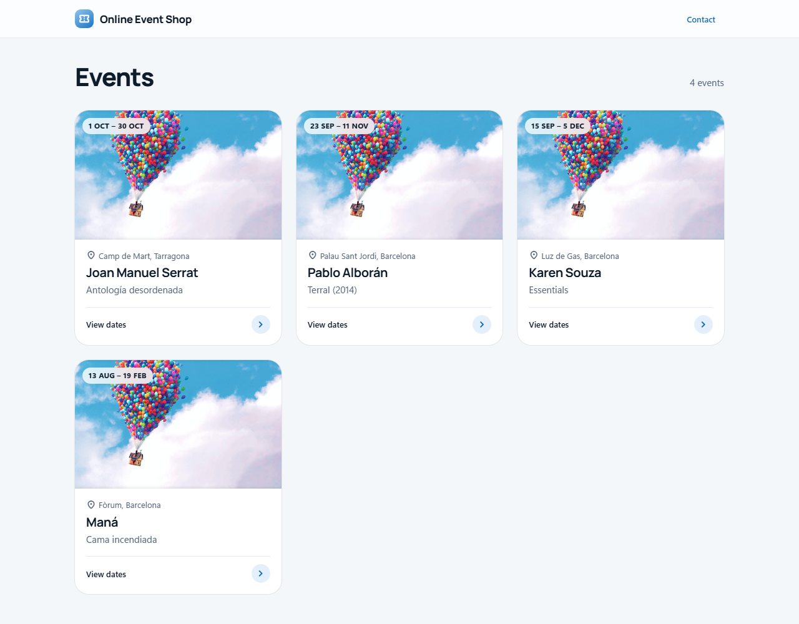
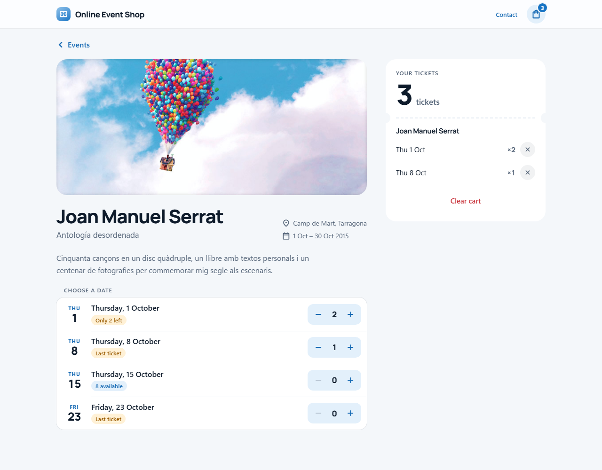
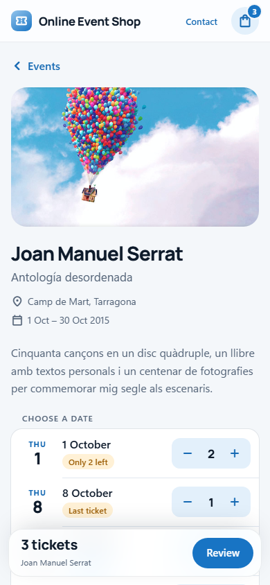
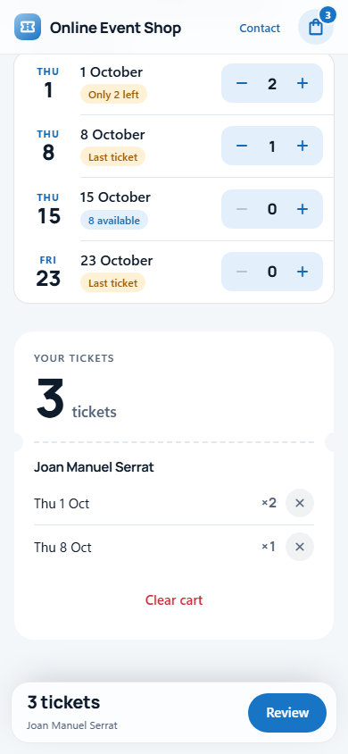
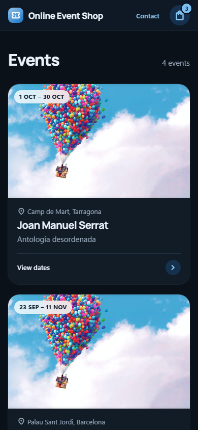

# 🎟️ Online Event Shop

A concert ticket shop built with **Angular 19**. Browse events, pick tickets for each date and manage them in an order summary that remembers your cart between visits. The UI uses its own light-blue design system and it switches to dark mode automatically.

---

## 🧰 Tech Stack

| Technology       | Usage                                                                  |
|------------------|------------------------------------------------------------------------|
| Angular 19       | Standalone components, built-in control flow (`@if`, `@for`)           |
| Angular Signals  | `input()`, `output()`, `computed()` and `toSignal()` with `OnPush`      |
| RxJS             | HTTP calls and cart state (`BehaviorSubject`)                          |
| Angular Router   | Navigation between the catalogue and the event page                    |
| SCSS             | BEM naming and CSS custom properties (design tokens); no UI library    |
| TypeScript       | Strict mode and strict templates                                       |
| Karma + Jasmine  | Unit tests with code coverage                                          |

---

## ⚽ Playground (run without installing anything)

https://stackblitz.com/~/github.com/Isaacgc1999/OnlineEventShop

## 📷 Screenshots

**Catalogue**



**Event page with tickets in the cart**



**Phone, light and dark mode**

<p>
  
  
  
</p>

---

## 🧑‍💻 Features

### 🗂️ Catalogue

- Responsive grid: 1 column on phones, up to 3 on desktop
- Each card is a single link to the event page and shows the image, date range, venue, title and subtitle
- Events sorted by end date (ascending)
- Loading skeletons, plus empty and error states

### 🎫 Event page

- Hero image, title, subtitle, venue, date range and description
- One row per session: day and date, an availability label and a `−` / `+` stepper
- Availability labels: `8 available`, `Only 2 left`, `Last ticket`, `Sold out`, `All in your cart`
- The stepper shows the tickets already in the cart and can't go below 0 or above the session's availability
- Shows "Dates aren't available" when an event has no session data (the mock API only includes events **68** and **184**)

### 🛒 Order summary (cart)

- Ticket-stub card with the total number of tickets, grouped by event
- Remove a date with one tap, or clear the whole cart, with an **Undo** option for 6 seconds
- Saved in `localStorage`, so the cart survives reloads and new visits
- Desktop: stays in view beside the session list
- Phones: a floating bar shows the ticket count and scrolls to the summary

### 🧭 Header

- Sticky, translucent bar with the logo and a Contact link
- Cart button with a ticket-count badge that opens the last event in your cart

---

## 🎨 Design System

All visual values live in [`src/styles/_tokens.scss`](src/styles/_tokens.scss) as CSS custom properties. Components only read these tokens, so dark mode is simply a second set of values for the same names (`prefers-color-scheme`).

| Token          | Light      | Dark       | Used for                              |
|----------------|------------|------------|---------------------------------------|
| `--bg`         | `#F4F7FA`  | `#0A1119`  | Page background                       |
| `--surface`    | `#FFFFFF`  | `#121C27`  | Cards, lists, order summary           |
| `--tint`       | `#E3F0FB`  | `#16314D`  | Secondary buttons, stepper, badges    |
| `--accent`     | `#1874C4`  | `#7CC0F2`  | Primary buttons (the only bright colour) |
| `--text`       | `#0E1B2B`  | `#EAF2FA`  | Titles and body text                  |
| `--text-2`     | `#536377`  | `#9AABBD`  | Subtitles and metadata                |

- **Typography:** Manrope for titles and numbers, the system font for body text (SF Pro on Apple devices), and Material Symbols Rounded for icons
- **Shape:** rounder corners on bigger objects (8 → 12 → 16 → 22 → 28 px) and pill-shaped buttons
- **Accessibility:** touch-friendly controls (around 44 px), a visible focus ring, labelled stepper buttons, and no animation when the user prefers reduced motion

Breakpoint mixins are in [`src/styles/_breakpoints.scss`](src/styles/_breakpoints.scss):

```scss
@use 'styles/breakpoints' as bp;

.grid {
  gap: 20px;

  @include bp.up(bp.$md) {   // ≥ 900px
    gap: 24px;
  }
}
```

The shared button:

```html
<app-button variant="primary | tinted | plain" size="sm | md | lg" tone="danger" block loading>
  Label
</app-button>
```

---

## 📱 Responsive Layout

| Screen              | Gutters | Event page                                              |
|---------------------|---------|---------------------------------------------------------|
| Phone (< 600 px)    | 16 px   | Stacked; floating cart bar at the bottom                |
| Tablet (600–899 px) | 24 px   | Stacked; floating cart bar at the bottom                |
| Desktop (≥ 900 px)  | 40 px   | Sessions on the left, order summary pinned on the right |

The catalogue fills the width with cards at least 280 px wide: 1 column on phones, 2 on tablets and 3 on wide screens. Content is capped at 1120 px wide.

---

## 🧱 Project Architecture

```
src/
├── app/
│   ├── core/
│   │   ├── models/             # cart, event, event-info, session-row, catalogue-state
│   │   └── services/
│   │       ├── cart/           # cart state + localStorage
│   │       └── catalogue/      # mock API (public/mocks)
│   ├── features/
│   │   ├── catalogue/          # event list page
│   │   └── event-info/         # event page
│   │       └── card-info/      # session list with steppers
│   ├── shared/
│   │   ├── components/
│   │   │   ├── button/         # app-button (variants, sizes, loading)
│   │   │   ├── card/           # event card
│   │   │   ├── cart/           # order summary + floating phone bar
│   │   │   └── number-input/   # ticket stepper
│   │   ├── header/
│   │   └── models/             # button types
│   ├── app.config.ts
│   └── app.routes.ts
├── styles/
│   ├── _tokens.scss            # design tokens + dark mode
│   └── _breakpoints.scss       # up() / down() media query mixins
├── styles.scss                 # global base styles
└── index.html
public/
├── images/                     # event image
└── mocks/                      # events.json, event-info-68.json, event-info-184.json
```

Each component folder contains its `.ts`, `.html`, `.scss` and `.spec.ts` files. Types and interfaces live only in `models/` folders, never inside components.

---

## 🧪 Testing

**55 tests** across 11 spec files, all passing.

| Coverage   | Result                 |
|------------|------------------------|
| Statements | **90.86 %** (199 / 219) |
| Branches   | **91.66 %** (44 / 48)   |
| Functions  | **91.30 %** (63 / 69)   |
| Lines      | **91.50 %** (183 / 200) |

What the tests cover:
- `CartService`: add, update, remove a session, clear and restore (Undo), `localStorage` persistence
- `CatalogueService` and the catalogue page: sorting, rendering and the error state
- Session list: availability labels, and tickets already in the cart
- Stepper: bounds, disabled states and accessible labels
- Order summary: totals, removing a session, empty state, clear and Undo
- Button: projected content, default `type="button"`, disabled and loading states, variants
- Inputs and outputs, tested through host components

To regenerate the coverage report:

```bash
npx ng test --watch=false --code-coverage
```

The HTML report is written to `coverage/`.

---

## 🚀 How to Run

1. Install dependencies:
   ```bash
   npm install
   ```
2. Start the dev server (http://localhost:4200):
   ```bash
   npm start
   ```
3. Run the tests:
   ```bash
   npm test
   ```
4. Build for production:
   ```bash
   npm run build
   ```
